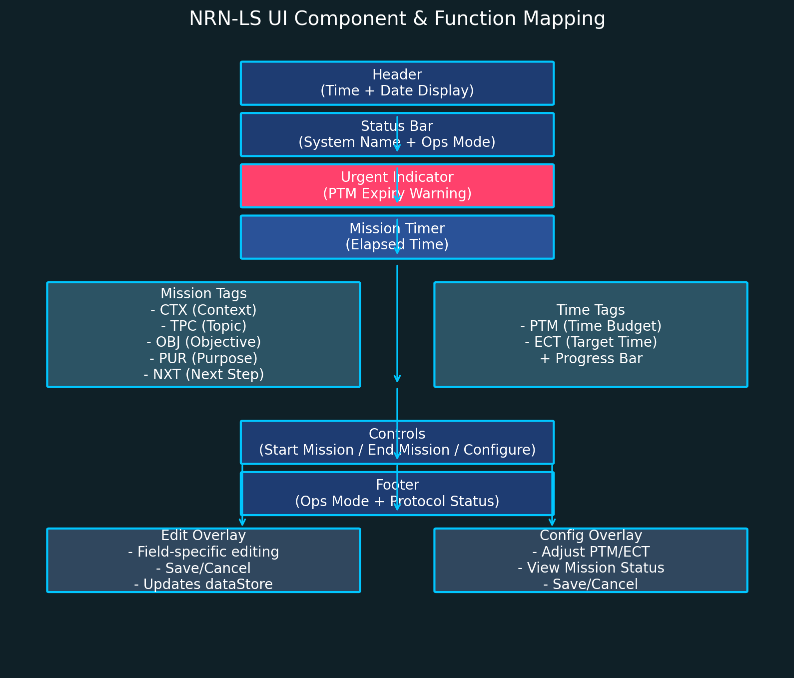

<main>
# **Software Requirements Document (SRD)**

**System Name:** Neural Recall Node (NRN) – Lock Screen Interface  
**Version:** 0.1.0  
**Date:** 2025-08-15  

---

## 1. **Purpose**

The Neural Recall Node Lock Screen (NRN-LS) is a task-focused operational display designed to present key mission context, timing, and objectives for high-focus work sessions. It provides an interactive UI for editing mission parameters, managing a mission timer, and receiving alerts when time budgets approach expiration.

---

## 2. **Scope**

The NRN-LS runs as a standalone HTML/JS/CSS application in modern browsers.
Its main functions are:

* Displaying **contextual mission tags** (CTX, TPC, OBJ, PUR, NXT)
* Showing **current time** and **date**
* Managing **time budgets** (PTM, ECT) with visual progress
* Alerting when PTM (Primary Time Management) approaches expiration
* Providing **edit modals** for field updates
* Allowing configuration of alert thresholds and mission durations
* Switching between **Active Mode** and **Mission Mode**

---

## 3. **Definitions**

| Acronym  | Meaning                                        |
| -------- | ---------------------------------------------- |
| CTX      | Context — where/when the activity is happening |
| TPC      | Topic — main subject of focus                  |
| OBJ      | Objective — actionable mission goal            |
| PUR      | Purpose — strategic reason                     |
| NXT      | Next Step — immediate following action         |
| PTM      | Provisioned Time ( time budgeted in minutes)   |
| ECT      | Estimated Completion Time (target)             |
| Ops Mode | Current operational state of the system        |

---

## 4. **Functional Requirements**

### 4.1 Display Requirements

* **Header**

  * Show current system time (HH\:MM) updated every minute
  * Show current date in format: `Weekday, Month Day, Year`
* **Status Bar**

  * Show system name and version
  * Show current Ops Mode (`Active` or `Mission`)
* **Urgent Indicator**

  * Visible when PTM ≤ configured warning threshold
  * Blinks (pulse animation) and shows minutes remaining
* **Mission Timer**

  * Shows elapsed mission time (MM\:SS) once mission starts
* **Tags Section**

  * Editable fields: CTX, TPC, OBJ, PUR, NXT
  * Each field has a short label, value, and description
* **Time Tags**

  * PTM with remaining minutes and progress bar
  * ECT with target time
* **Footer**

  * Current Ops Mode + Protocol status

---

### 4.2 Editing Requirements

* Clicking a `.tag-content` opens the **Edit Overlay**:

  * Title specifies which tag is being edited
  * Textarea pre-filled with current value
  * Save button updates value in memory (`dataStore`)
  * Cancel closes modal without saving

---

### 4.3 Mission Control

* **Start Mission Button**

  * Switches Ops Mode to "Mission"
  * Records start timestamp
  * Starts timer updating every second
  * Changes button to "End Mission"
* **End Mission Button**

  * Switches Ops Mode to "Active"
  * Stops timer
  * Resets UI state
* Mission status is stored in memory

---

### 4.4 Configuration

* **Config Overlay**

  * Fields to adjust:

    * PTM Warning Threshold (minutes)
    * PTM Total Duration (minutes)
    * ECT Duration (minutes)
  * Shows current mission status, remaining PTM, and alert status
  * Validates inputs:

    * PTM Warning: 1–60 min
    * PTM Total: 5–480 min
    * ECT: 1–480 min
  * Save updates `dataStore` and reloads data
  * Cancel closes modal without saving

---

## 5. **Non-functional Requirements**

* **Performance**: UI updates must remain under 100ms latency for visible changes.
* **Browser Support**: Latest stable Chrome, Firefox, Edge; fallback for Safari with possible style degradation.
* **Responsiveness**: Adjust layout for max-width ≤ 480px (smaller fonts, reduced padding).
* **Data Persistence**: Current version stores all mission data in-memory (`dataStore`) only; no backend or localStorage.

---

## 6. **User Interface Design**

* **Theme**: Cyber-ops aesthetic with deep blue gradients and neon cyan accents
* **Typography**: Segoe UI or system sans-serif
* **Interactions**:

  * Hover effects for editable tags
  * Pulsing alerts for urgent PTM status
  * Smooth button hover transitions
* **Icons**: Font Awesome v6 for status, alerts, and controls

---

## 7. **Data Model**

```javascript
dataStore = {
    context: string,
    topic: string,
    objective: string,
    purpose: string,
    next: string,
    missionActive: boolean,
    missionStartTime: timestamp|null,
    progressPercentage: number, // 0–100
    ptmTotalMinutes: number,
    ectMinutes: number,
    ptmWarningMinutes: number
}
```

---

## 8. **Constraints**

* All time values are in minutes.
* No server interaction; purely client-side.
* Mission timer is reset if page reloads.
* No authentication — assumed single-user local use.

---

## 9. **Future Enhancements**

* Persist mission state to localStorage or backend
* Multi-mission history logs
* Audio alerts for PTM threshold
* Dark/light mode toggle
* Sync with external calendars or task systems

---



Here’s the NRN-LS **UI Component & Function Mapping** diagram — it visually links the interface’s sections 
(Header, Status Bar, Mission Tags, etc.) to their functional roles, matching the SRD’s structure.

# Readme 

The reason for this app is detailed at [NRN: Neural Recall Node](./Readme.html)

</main>


