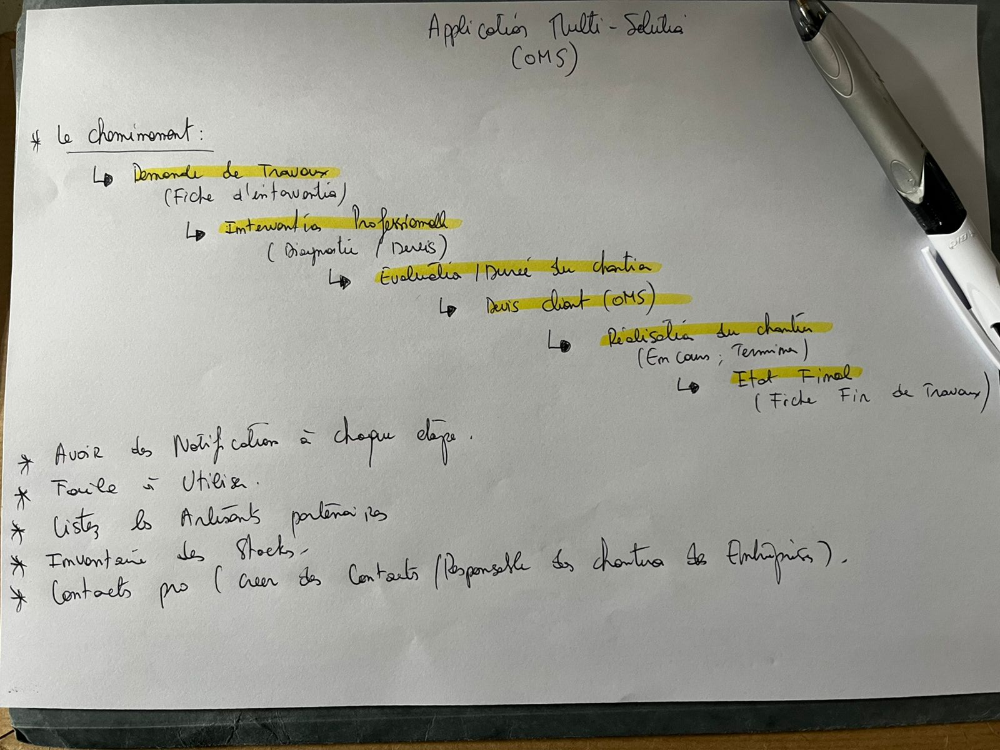

<main>

<article>

# Liens utiles

DOMAIN KNOWLEDGE

- [la-fiche-dintervention](https://lecoursgratuit.com/la-fiche-dintervention-travaux-un-outil-essentiel-pour-la-gestion-efficace-des-chantiers/)
- [construction-management](https://altersquare.medium.com/mobile-first-design-for-construction-management-software-field-usability-guide-3f52adf45b02)
- [construction-app-dev](https://exoft.net/construction-app-development-guide/)
- [construction-app](https://ascendixtech.com/construction-app-development/)

</article>
<article>

# Dashboard

- Fiche d'intervention: Demande de travaux
  * devis tâche travailleurs (interne)
  * devis proformat société (coté client)
- Annuaire professionelle
  * par profession
  * par devis (OMS)
  * par disponibilité
  * par responsabilité
- Repertoire Chantiers
  * Evaluation par Tâche
  * Durée du projet
  * Suivi, Progression du chantier
  * Status du chantier
- Archive, Etat-final
  * Fiche fin des travaux
  * Archivage et telechargement
- Inventaire des Stocks
  * par code, id
  * par catégorie
  * par chantier
  * par qté, disponibilité
</article>
<section style="float:left;">
<a href="./static/img/preliminaire-2025-05-27-17-42-58.jpg">
<aside>
{width="200px"}
</aside>
</a>
</section>

</main>
