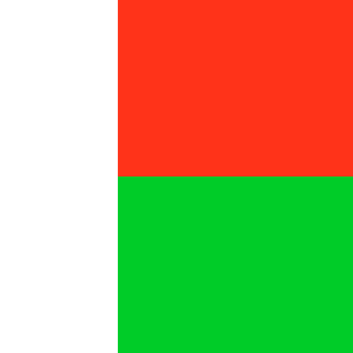

<main>
<section>

# Contact Atova

- whatsapp 034 13 782 71 roby

<nav>
<ul class="flex gap-4 float-right">
<li id="select_en"></li>
<li id="select_mg"></li>
<li id="select_fr"></li>
</ul>
</nav>

</section>

voir aussi:  

- [Kconstruction (fr) produit sous licence pour Solus](./dashboard/concept_fr.html)

# Concept Kômandy 

Kômandy is a *Product Suite* developed by **A**tova

The two main focuses are the implementation of desktop-oriented functionality for management
and mobile/app functionality for operational purposes.

The latter are developed as independent modules that are integrated and operated
under the Kômandy label.

Kômandy est une suite de produits développée par **A**tova.

Les deux axes principaux sont la mise en œuvre de fonctionnalités orientées bureau pour la gestion et de fonctionnalités mobiles/applicatives à des fins opérationnelles.

Ces dernières sont développées sous forme de modules indépendants, intégrés et exploités sous le label Kômandy.

<section>
<aside>
<h2 style="padding-top: 0.5rem;content: url('./static/img/001.kLogistics.png'); margin-left: 3rem;">Klogistics</h2>

The design and development of all our Products that tend to lean towards Desktop or web platform are 
guided by three concepts which we have branded as Kinventory, Kdeploy and Kprocurement.

La conception et le développement de tous nos produits qui tendent vers une plate-forme de bureau 
ou Web sont guidés par trois concepts que nous avons nommés Kinventory, Kdeploy and Kprocurement.

- Kinventory
- Kdeploy
- Kprocurement

</aside>
<aside>
<h2 style="padding-top: 0.5rem;content: url('./static/img/002.kOperations.png'); margin-left: 3rem;">Koperations</h2>

Two key aspects in developing field or offsite Products 
that tend to lean towards Mobile or web platform are the ability to organize and monitor work and workers.
These activities fall under the categories Kmonitor and Kunit

Deux aspects clés du développement de produits sur le terrain ou hors site, généralement orientés vers les plateformes mobiles ou web, sont la capacité d'organiser et de suivre le travail et les collaborateurs.
Ces activités relèvent des catégories Kmonitor et Kunit.

- Kmonitor
- Kunit

</aside>
</section>

## Klogistics

- Kinventory
- Kdeploy
- Kprocurement

## Koperations

- Kmonitor
- Kunit

# Our products

<section>
<aside>
<h2 style="padding-top: 0.5rem;content: url('./static/img/008.kFleet.png'); margin-left: 3rem;">kFleet</h2>

## Kfleet

Track your vehicles' maintenance and service history.
Measure fuel consumption and schedule automatic maintenance reminders.
Wherever you are, stay in control with our desktop, web, or mobile app.

Suivez l'historique d'entretien et de maintenance de vos véhicules.
Mesurez votre consommation de carburant et programmez des rappels d'entretien automatiques.
Où que vous soyez, gardez le contrôle grâce à notre application pour ordinateur, web ou mobile.

</aside>
<aside>
<h2 style="padding-top: 0.5rem;content: url('./static/img/009.kElec.png'); margin-left: 3rem;">kElec</h2>

## Kelec

</aside><aside>
<h2 style="padding-top: 0.5rem;content: url('./static/img/010.kBuildyard.png'); margin-left: 3rem;">kBuildyard</h2>

## Kbuildyard

</aside><aside>
<h2 style="padding-top: 0.5rem;content: url('./static/img/011.kTimeTrac.png'); margin-left: 3rem;">kTimeTrac</h2>

## KtimeTrac
Schedule, track, and measure performance
</aside><aside>
<h2 style="padding-top: 0.5rem;content: url('./static/img/012.kZoky_B.png'); margin-left: 3rem;">kZoky_B</h2>

## Kzoky_B

</aside>
</section>

---

# Other products

## Kpris

Private Realtime Interaction System

## AIza

- A.I. Powered dedicated Search Engine for Madagascar and Mahasagar (the Indian-Ocean) ...more
: Mahasagar, Mahāsāgara (महासागर) is the Hindi word for "ocean" buḥār بحر in Arabic, bahari in Swahili
</main>
<section>
{style="width:60%;height:45%;"}
</section>

<!-- SELECT LANG -->

