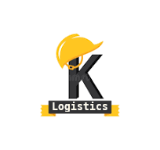

<main>
MOVED TO Komandy INDEX
<article>

# Concept Kômandy 

Kômandy is a *Product Suite* developed by **A**tova

The two main focuses are the implementation of desktop-oriented functionality for management
and mobile/app functionality for operational purposes.

The latter are developed as independent modules that are integrated and operated
under the Kômandy label.

Kômandy est une suite de produits développée par **A**tova.

Les deux axes principaux sont la mise en œuvre de fonctionnalités orientées bureau pour la gestion et de fonctionnalités mobiles/applicatives à des fins opérationnelles.

Ces dernières sont développées sous forme de modules indépendants, intégrés et exploités sous le label Kômandy.

* 
  - Kinventory
  - Kdeploy
  - Kprocurement

* 
  - Kmonitor
  - Kunit

</article>

voir aussi:  

- [Kconstruction (fr) produit sous licence pour Solus](./concept_fr.html)

</main>
